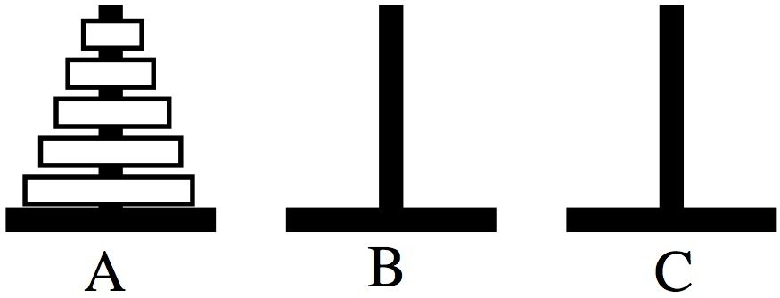

# Лабораторная работа №7

## Что такое Ханойская башня?
**Ханойская башня** - это загадка прямиком из 19 века. Суть загадки заключается в том, что нам даны три стержня(A,B,C), на один из которых нанизаны кольца отличающиеся по размеру и лежащие от меньшего к большему. Необходимо перенести пирамиду из колец на другой стержень за наименьшее число операций. За одну операцию можно переносить одно кольцо. Запрещается класть большее кольцо на меньшее.

---
## Рекурсивное решение
**Рекурсивное решение** заключается в том, чтобы перенести (n-1) колец на стержень B, а самое большое кольцо на стержень C. Далее при помощи рекурсии решаем задачу перенести (n-1) колец на стержень C.

---
## «Треугольное» решение
Стержни необходимо расположить в виде треугольника. Малое кольцо перкладываем на любой свободный стержень(теперь это кольцо нужно перемещать только в том же направлении). Далее перекладываем другое кольцо на свободный стержень, после чего снова перекладываем малое кольцо и повторяем действия до решения.

---
## Циклическое решение
Для описания метода решения введём запись: 1-2 обозначает, что мы перекладываем кольцо или с 1-го стержня на 2-ой или со 2-го на 1-ый, в зависимости от того, где он меньше(аналогично с другими стержнями). Если кол-во колец чётное, тогда необходимо повторять действия 1-2, 1-3, 2-3. Иначе 1-3, 1-2, 2-3.

---
## Применение кода Грея для решения
**Код Грея** - это двоичный код в двоичной система счисления, в котором 2 соседних значения отличаются только в одном двоичном разряде.  
**Код Грея для решения задачи** В коде Грея длины **N**, состоящем из нулей, сопоставим каждому i-му биту i-ое кольцо(самому младшему биту - меньшее кольцо, старшему биту - наибольшее). Каждое изменение бита(за шаг меняется один бит), можно понимать как перемещение кольца. Для всех колец, на каждом шаге имеется один вариант хода(для наименьшего два). Обозначим сержни: A - начальный стержень, B - финальный стержень, C - оставщийся стержень. 
- Для чётного кол-ва колец решение имеет вид: A -> С -> B -> A -> C -> B и т.д. 
- Для нечётного: A -> B -> C -> A -> B -> C и т.д.
