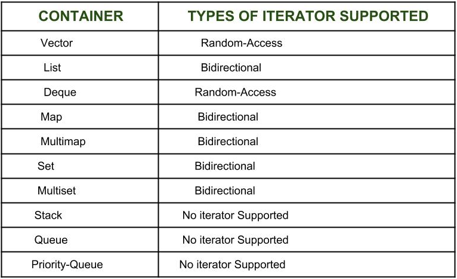

# Лабораторная работа №8.2

## Задание: для контейнера из лабораторной 8.1 реализуйте итератор.

## Ответы на вопросы:

### 1. Что такое итератор?

Итератор — это объект, разработанный специально для перебора элементов контейнера (например, значений массива или символов в строке), обеспечивающий во время перемещения по элементам доступ к каждому из них.
Контейнер может предоставлять различные типы итераторов. Например, контейнер на основе массива может предлагать прямой итератор, который проходится по массиву в прямом порядке, и реверсивный итератор, который проходится по массиву в обратном порядке.

### 2. Какие типы итераторов выделяют в языке С++?

Помимо итераторов, осуществляющих доступ к данным определённого контейнера в библиотеке STL имеются ещё несколько итераторов:
1. back_insert_iterator и front_insert_iterator
2. insert_iterator
3. istream_iterator и ostream_iterator

Итераторы типов back_insert_iterator и front_insert_iterator при модификации содержимого осуществляют вставку элемента методом push_back() или push_front(). Операции перемещения к предыдущему/следующему элементу контейнера эти итераторы попросту игнорируют.

Итератор insert_iterator при модификации осуществляет вставку данных. Ему в конструктор передаются контейнер и итератор на позицию, куда следует вставлять данные.

Итераторы istream_iterator и ostream_iterator осуществляют считывание данных из потока и запись данных в поток. В конструкторы этих итераторов необходимо передать входной или же выходной поток.
 
Существующая классификация итераторов насчитывает 5 категорий итераторов:
1. Input iterator
2. Output iterator
3. Forward iterator
4. Bidirectional iterator
5. Random access iterator

Итераторы, принадлежащие различным категориям имеют различный набор допустимых операций.

В зависимости от функциональности итераторов их можно разделить на пять основных категорий:

* Итераторы ввода : они самые слабые из всех итераторов и имеют очень ограниченную функциональность. Они могут использоваться только в однопроходных алгоритмах, т. Е. В тех алгоритмах, которые последовательно обрабатывают контейнер так, что к элементу не обращаются более одного раза.
* Выходные итераторы : так же, как входные итераторы , они также очень ограничены в своей функциональности и могут использоваться только в однопроходном алгоритме, но не для доступа к элементам, а для назначенных элементов.
* Прямой итератор : они выше по иерархии, чем входные и выходные итераторы , и содержат все функции, присутствующие в этих двух итераторах. Но, как следует из названия, они также могут двигаться только в прямом направлении, и это тоже шаг за шагом.
* Двунаправленные итераторы : у них есть все возможности прямых итераторов, а также тот факт, что они преодолевают недостаток прямых итераторов , поскольку они могут двигаться в обоих направлениях, поэтому их имя является двунаправленным.
* Итераторы с произвольным доступом : это самые мощные итераторы. Они не ограничены последовательным перемещением, как следует из их названия, они могут произвольно обращаться к любому элементу внутри контейнера. Это те, чья функциональность аналогична указателям.

### 3. В чем их преимущество?

1. Удобство в программировании: лучше использовать итераторы для перебора содержимого контейнеров, как если бы мы не использовали итератор и обращались к элементам с помощью оператора [], тогда нам всегда нужно варьировать размер контейнера, тогда как при итераторы, мы можем просто использовать функцию-член end () и перебирать содержимое без необходимости что-либо иметь в виду.

2. Итераторы поддерживают повторное использование кода, так как они могут использоваться для доступа к элементам любого контейнера.

3. Динамическая обработка контейнера: итераторы предоставляют нам возможность динамически добавлять или удалять элементы из контейнера в любое удобное для вас время.